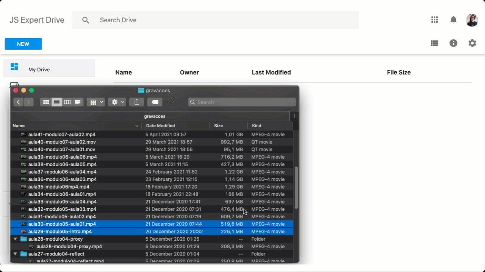

# Google Drive Clone - JS Expert Week 5.0

Welcome to the fifth Javascript Expert Week. This is the starting code to start our journey.

Tag this project with a star 🌟

## Preview

## Checklist Features

- Web API
    - [] It should list downloaded files
    - [] It must stream files and save them in disk
    - [] It should notify about progress of storing files to disk
    - [] It must allow uploading of files in image, video or audio format
    - [] It must reach 100% code coverage in tests

- Web App
    - [] Should list downloaded files
    - [] Should allow uploading of files of any size
    - [] Must have upload function via button
    - [] Should display upload progress
    - [] Must have drag and drop upload function

## Challenges for you to extend this project

1. *Backend*: Save the file to AWS or any storage service
     - Our project today stores files on disk. the challenge is you via Stream, uploading to some cloud service
     - As a plus, keep 100% code coverage, that is, create tests for your new feature
2. *Frontend*: Add frontend tests and achieve 100% code coverage
    - You learned how to test in the backend. Use the same process to create frontend unit tests with Jest
    - If you have any doubts, go to [example](https://github.com/ErickWendel/tdd-frontend-example) and leave a star!
3. *Infrastructure*: Publish application with your custom SSL in virtual machine
    - You learned how to generate local SSL, the challenge is for you to create a certificate (it can be with *Let's Encrypt*) and add it to your application

## Layout Credits <3

- The Layout was adapted from the project by the Brazilian [Leonardo Santo](https://github.com/leoespsanto) available on [codepen](https://codepen.io/leoespsanto/pen/KZMMKG).

## FAQ
- `NODE_OPTIONS` is not a system recognized command, what to do?
    - If you are on Windows, the way to create environment variables is different. You must use the word `set` before the command.
    - Ex: ` "test": "set NODE_OPTIONS=--experimental-vm-modules && npx jest --runInBand",`

- SSL certificate is invalid, what to do?
    - This error happens because I generated a certificate linked to the user of my machine.
    - You can click on proceed in the browser and use the invalid certificate and the project will continue working, but if you want to generate your own, I wrote the step by step in [./certificates](./certificates)

- I ran `npm test` but nothing happens, what to do?
    - Check your Node.js version. We are using version 16.8. Go to [node.js website](https://nodejs.org) and download the latest version.
